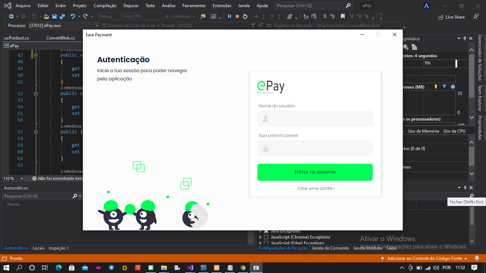
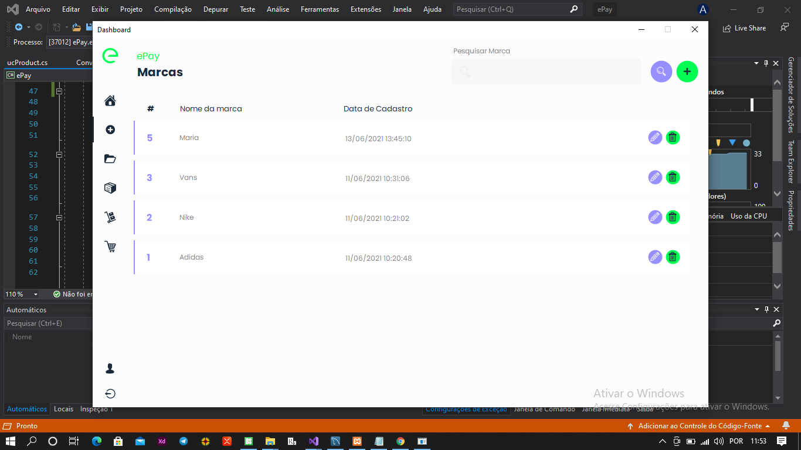
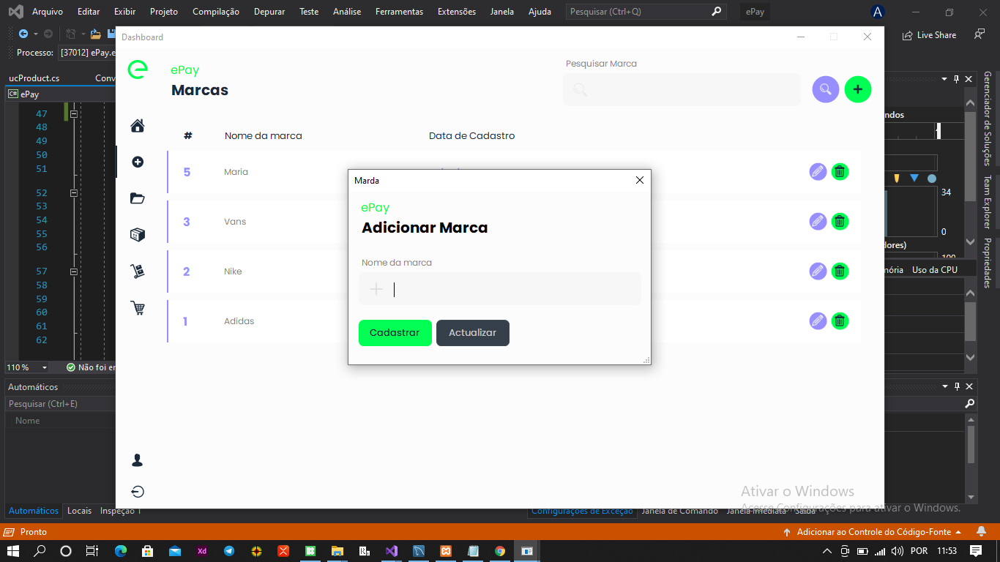

# e-PAY Easy Payment :blush:

**About the project** 
`e-pay` or facilitated payment is a platform that was developed or created with the aim of facilitating any type of payment at the level of stores or companies that sell any type of product in an easy way, it was created with the existing commercial management software in mind, but with additional features that the market already offers.

**Purpose or objective for now**
The application is at an early stage and for now I'm developing the most common features so that later new features can be implemented.

- At the structuring level, it has a well-designed architecture obeying clean code principles and design standards
- Open to any kind of contribution
- The programming was developed using layers that are, `business`, `data access`, `entities`, `interfaces` among others. :heart_eyes:

## Interface presentation



Brand registration



Adding brand




**Present layers of the project**

Entities for Authentication

```csharp
public class Auth
{     
    public int Id_auth { get; set; }
    public Employee User { get; set; }
    public string Username { get; set; }
    public string Password { get; set; }
    public int InAdmin { get; set; }
}
```

Generic repository

```csharp
interface IGenericRepository<Entity> where Entity:class
{
    int Create(Entity entity);
    DataTable Read();
    int Update(Entity entity);
    int Delete(int id);
    DataTable Search(string name);
}
```

Data access layer has numerous methods I only present one method contained in it

```csharp
private readonly string _StrCon;

public string StrCon
{
    get => _StrCon;
}
public DataAccess(string StrCon)
{
    this._StrCon = StrCon;
}

// Execute Non Query
protected int ExNonQuery(string cmdText, CommandType cmdType = CommandType.Text, MySqlParameter[] parameter = null)
{
    using (MySqlConnection conection = new MySqlConnection(StrCon))
    {
        conection.Open();

        MySqlCommand command = new MySqlCommand(cmdText, conection);
        if(cmdType == CommandType.StoredProcedure)                
            command.CommandType = CommandType.StoredProcedure;
        if(parameter != null)
        {
            for (int i = 0; i < parameter.Length; i++)
            {
                command.Parameters.Add(parameter[i]);
            }
        }
        int result = command.ExecuteNonQuery();
        return result;
    }
}

// Execute Reader
protected DataTable ExReader( string cmdText, CommandType cmdType = CommandType.Text, MySqlParameter[] parameter = null)
{
    using (MySqlConnection conection = new MySqlConnection(StrCon))
    {
        conection.Open();

        MySqlCommand command = new MySqlCommand(cmdText, conection);
        if (cmdType == CommandType.StoredProcedure)
            command.CommandType = CommandType.StoredProcedure;
        if (parameter != null)
        {
            for (int i = 0; i < parameter.Length; i++)
            {
                command.Parameters.Add(parameter[i]);
            }
        }
        DataTable table = new DataTable();
        table.Load(command.ExecuteReader());
        return table;
    }
}
```
Business layer

```csharp
public Authentication(string StrCon = "datasource=localhost; username=root; password=; database=db_sales;") 
    : base(StrCon)
{ }

public Auth VerifyAccess(string username, string password)
{            
    MySqlParameter[] param = new MySqlParameter[] 
    {
        new MySqlParameter("@username_auth", username),
        new MySqlParameter("@passsword_auth", password)
    };

    DataTable table = ExReader("sp_auth",
            cmdType:   CommandType.StoredProcedure,
            parameter: param);
    
    return (table.Rows.Count > 0) ?
        new Auth()
        {
            Id_auth = (int)table.Rows[0][0],
            User = new Employee()
            {
                Id = (int)table.Rows[0][1],
                Name = table.Rows[0][6].ToString(),
                Phone = (int)table.Rows[0][7]
            },
            Username = table.Rows[0][2].ToString(),
            InAdmin = (int)table.Rows[0][4]
        } 
        : null;
}        
```

## License

Copyright (c) 2021 **António Campos Gabriel**

